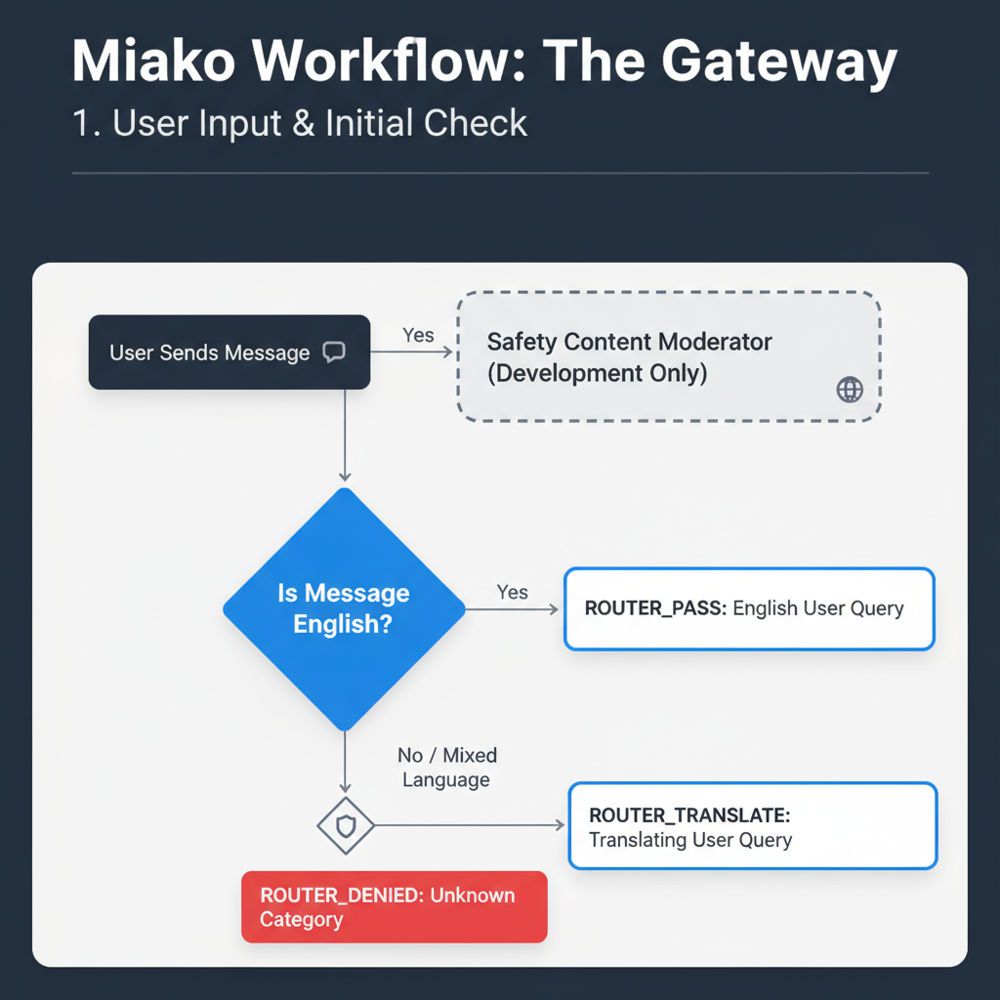
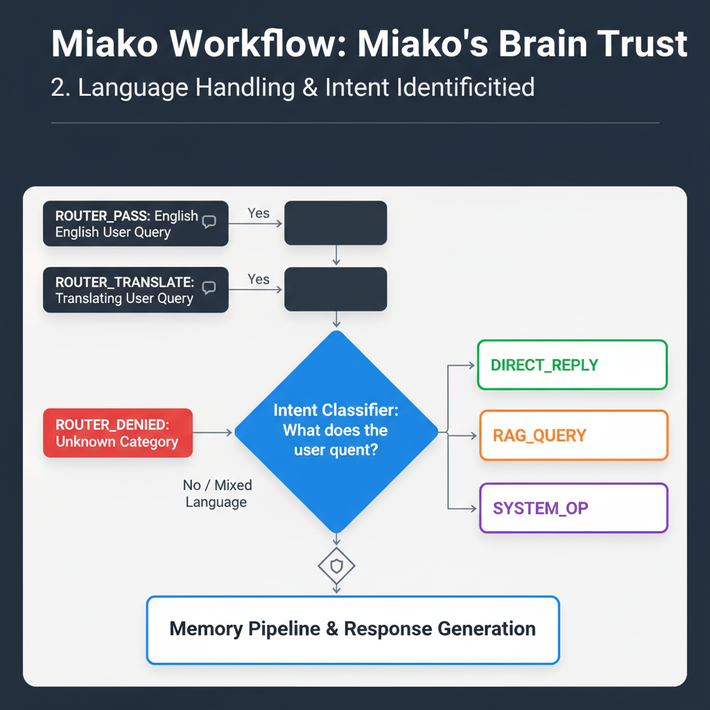
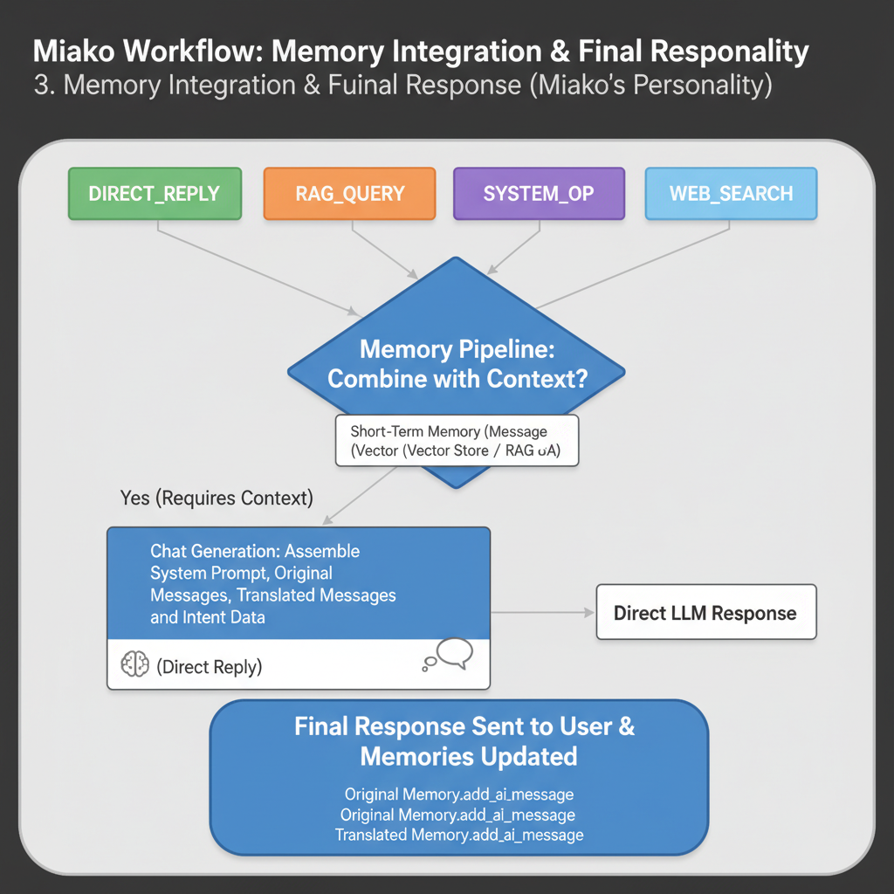

# Miako: The High-Concurrency AI Assistant for Modern Customer Service

Miako is an open-source, production-grade AI backend designed to bridge the gap between rigid, frustrating chatbots and fluid, human-like conversation. Built on an async-native FastAPI architecture, Miako is engineered to handle thousands of concurrent users with sub-second latency, providing a seamless and intelligent customer service experience.

---

##  **The Vision: Beyond Basic Chatbots**

Our vision is to redefine automated customer service by creating an AI that is not only fast and scalable but also **contextually aware, culturally fluent, and fundamentally reliable.** We believe that the future of BPO automation lies in deterministic, goal-oriented systems that understand users on their own terms—from complex "Taglish" code-switching to the nuances of Gen-Z slang.

## **The Mission: Core Principles**

Miako is being built with a few uncompromising principles in mind:

*   **Performance Above All:** To deliver a superior user experience, every response must be fast. By leveraging Groq's LPU and a highly optimized async workflow, Miako aims for sub-second responses, eliminating the awkward pauses that plague traditional AI assistants.

*   **Deterministic Workflow over Agentic Freedom:** While AI agents are powerful, they can be unpredictable. Miako operates on a **deterministic CrewAI flow**. This means every user query follows a logical, pre-defined path of analysis (Language → Intent → Action). This ensures reliability, prevents unexpected behavior, and makes the system safe for real-world business logic.

*   **Cost-Efficiency by Design:** We architect Miako to be powerful yet affordable. Instead of relying on a single, massive reasoning model for every task, we use smaller, faster, and more cost-effective models for specialized jobs like language identification and intent classification. The right tool for the right job.

*   **The Safety Net: Proactive Clarification:** We are architecting a crucial fallback mechanism. When the workflow is uncertain or lacks context, it won't guess and risk an error (like deleting a database). Instead, it will trigger a specialized "clarification" LLM. This LLM will act like a curious child, asking the user simple, targeted questions to remove ambiguity before proceeding. This makes the system safer, smarter, and more collaborative.

---

##  **Miako's Thought Process: A Visual Workflow**

To understand how Miako handles each message, here is a step-by-step breakdown of her internal decision-making process.

#### 1. The Gateway: Language and Safety Check
The first step is to triage the incoming message, checking its language and ensuring it's safe to process.

#### 2. The Brain Trust: Intent Identification
Once the language is understood, Miako's core brain trust determines what the user actually *wants* to do.

#### 3. The Personality: Memory and Response Generation
Finally, Miako gathers all context from short-term memory (and long-term RAG if needed) to craft a coherent, intelligent, and personalized response.

---

## **Key Features**

*   **Asynchronous-First Architecture:** Built with FastAPI to handle high I/O and thousands of simultaneous connections without blocking.
*   **CrewAI Flow Orchestration:** A deterministic, multi-step workflow ensures predictable and reliable query processing.
*   **Advanced RAG with Hybrid Search:** Combines dense vector search (Cohere) and sparse keyword search (BM25) via Zilliz Cloud for unparalleled retrieval accuracy.
*   **Custom Concurrency Control:** A bespoke locking mechanism (`LockManager`) guarantees strict user-state isolation, preventing "context bleeding" and race conditions.
*   **"Glass Box" Retrieval Security:** Granular control over the context fed to the LLM prevents prompt injection and data leakage.
*   **Multi-Language & Slang Understanding:** Specifically designed to translate and comprehend code-switching (Taglish) and modern vernacular.

